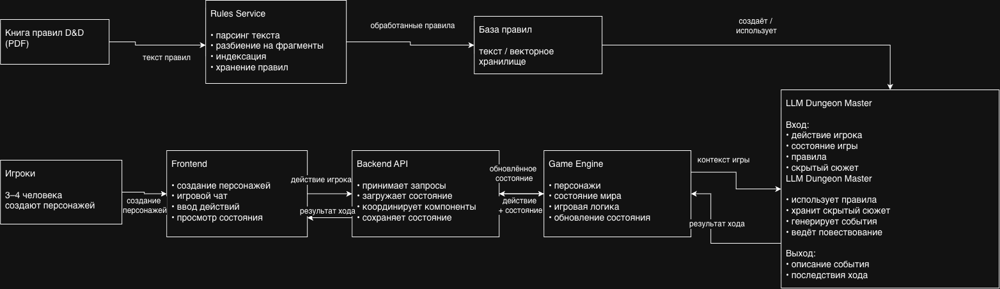

# AI Dungeon Master

AI Dungeon Master — приложение для проведения текстовой настольной RPG, где роль ведущего выполняет LLM.

Пользователи создают персонажей и взаимодействуют с игровым миром через текст. LLM формирует скрытую сюжетную канву и в процессе игры реагирует на действия игроков с учётом текущего состояния игры и правил.

## Архитектура

Предварительная схема взаимодействия компонентов:



На нулевой итерации выделены следующие компоненты системы.

### Backend / Application

API приложения и основной компонент для взаимодействия между частями системы.

Предполагаемые задачи:

- создание игровых сессий;
- хранение персонажей;
- хранение истории игры;
- хранение текущего состояния игровой сессии;
- взаимодействие между Frontend, Game Engine и другими компонентами;
- сохранение обновлённого состояния игры.

### Game Engine

Компонент, отвечающий за игровую логику и изменение состояния партии.

Предполагаемые задачи:

- обработка текущего состояния игры;
- применение последствий действий игроков;
- изменение характеристик персонажей;
- работа с инвентарём;
- изменение состояния игрового мира;
- формирование обновлённого состояния партии.

### AI Dungeon Master

LLM-компонент, выполняющий роль ведущего игры.

Предполагаемые задачи:

- генерация скрытого сюжета кампании;
- ведение повествования;
- обработка действий игроков;
- генерация следующих игровых событий;
- определение последствий действий игроков с учётом состояния игры и правил.

При обработке игрового хода Dungeon Master использует четыре основных источника контекста:

- правила игры;
- скрытый сюжет кампании;
- текущее состояние игры;
- действие игрока.

На основе этого контекста Dungeon Master генерирует следующее игровое событие и последствия действия игрока.

### Rules Service

Компонент для работы с книгой правил.

Предполагаемые задачи:

- загрузка и обработка книги правил;
- извлечение текста;
- подготовка правил для использования AI Dungeon Master;
- предоставление необходимых фрагментов правил.

На первой итерации планируется простой вариант работы с текстом правил. В дальнейшем при необходимости может быть добавлен поиск релевантных фрагментов с использованием RAG.

### Frontend

Пользовательский интерфейс приложения.

Предполагаемые задачи:

- создание персонажей;
- создание и подключение к игровым сессиям;
- игровой чат;
- отправка действий персонажа;
- отображение ответов Dungeon Master;
- отображение текущего состояния игры.

## Основной игровой цикл

```text
Игрок
  ↓
Frontend
  ↓
Backend
  ↓
Game Engine
  ↓
AI Dungeon Master
  ↓
Game Engine
  ↓
Backend
  ↓
Frontend
  ↓
Игрок
```

Игрок отправляет действие через Frontend. Backend получает запрос и передаёт действие вместе с текущим состоянием игры в Game Engine.

Game Engine подготавливает игровой контекст для AI Dungeon Master. Dungeon Master учитывает состояние игры, действие игрока, скрытый сюжет и правила и генерирует следующее событие и последствия хода.

Game Engine применяет полученные последствия и формирует обновлённое состояние игры. Backend сохраняет новое состояние и передаёт результат хода на Frontend.

## Команда

| Участник | Зона ответственности |
|---|---|
| Наталья | Backend / Application |
| Денис | Game Engine, Frontend |
| Егор | AI Dungeon Master |
| Сергей | Rules Service, интеграция компонентов |

## Статус проекта

Проект находится на нулевой итерации.

На текущем этапе определены:

- идея проекта;
- основные компоненты системы;
- предварительные зоны ответственности;
- схема взаимодействия компонентов;
- основной сценарий игрового процесса.